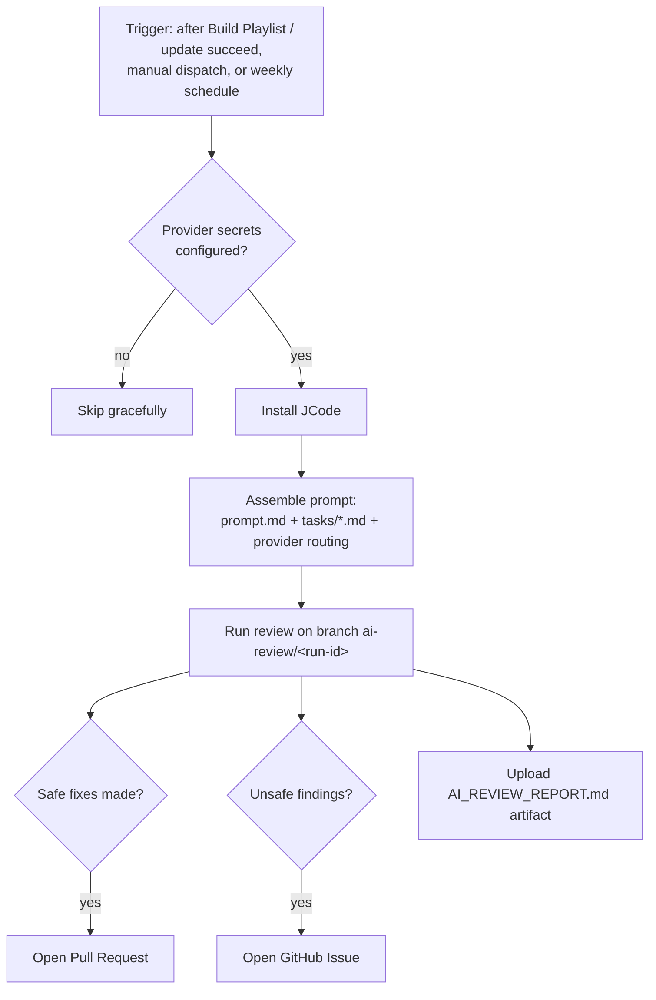

# AI Review System

This repository maintains itself with an AI-powered review workflow:
[`ai-review.yml`](../workflows/ai-review.yml). It periodically inspects the
playlists, workflows, documentation, and repository structure, then proposes
fixes as Pull Requests and files anything unsafe to auto-fix as GitHub
Issues. It **never pushes to `master` directly**.

## How it works



1. The workflow triggers after a successful `Build Playlist` or `update`
   run, manually, or on the weekly schedule (Mondays 03:00 UTC).
2. It detects which AI providers are available from repository secrets.
   If none are configured the run exits successfully with a notice.
3. It installs [JCode](https://github.com/1jehuang/jcode) (prebuilt release
   if available, otherwise a cached cargo build).
4. It assembles the review prompt from
   [`.github/ai-review/prompt.md`](../ai-review/prompt.md) plus any drop-in
   task files, and runs the agent on a dedicated branch.
5. Safe fixes become a PR labeled `ai-review`. Unsafe findings become an
   Issue. The full report is always uploaded as a run artifact.

## Providers

| Secret | Provider | Used for |
|--------|----------|----------|
| `ANTHROPIC_API_KEY` | Claude | Coding tasks: fixes, playlist edits, workflow changes |
| `OPENAI_API_KEY` | OpenAI | Architecture analysis and idea generation |
| `GEMINI_API_KEY` | Gemini | Documentation and writing tasks |

If only one secret is configured, that provider handles everything.

**Ollama** is a local-only option. It is never used inside GitHub Actions
(runners have no Ollama daemon). To use Ollama, run the review locally:

```bash
# On your machine, with Ollama running:
jcode -p "$(cat .github/ai-review/prompt.md)"
```

### Enabling a provider

Add the secret in **Settings -> Secrets and variables -> Actions -> New
repository secret** with the exact name from the table above.

### Disabling a provider

Delete the secret. The workflow re-detects providers on every run. To
disable the whole system, disable the "AI Review" workflow in the Actions
tab (no file changes needed).

## Triggering a review manually

1. Go to **Actions -> AI Review -> Run workflow**.
2. Optionally enter a `focus` instruction (for example
   "focus on the streams/ua.m3u file" or "audit workflow security only").
3. Click **Run workflow**.

Or with the GitHub CLI:

```bash
gh workflow run "AI Review" -f focus="check duplicate channels only"
```

## Adding new review tasks

Add a Markdown file to [`.github/ai-review/tasks/`](../ai-review/tasks/):

```
.github/ai-review/tasks/10-check-epg-links.md
```

```markdown
### Task: Check EPG links

Verify that every tvg-id referenced in streams/ follows the
Name.country[@Variant] convention. Auto-fixing is NOT safe; report only.
```

Files are appended to the prompt in filename order. Delete a file to remove
the task. The core checklist lives in
[`.github/ai-review/prompt.md`](../ai-review/prompt.md).

## Guarantees

- Existing playlist generation workflows are untouched and unaffected.
- All changes arrive via PR on `ai-review/<run-id>` branches, protected by
  the normal `check` PR workflow.
- The workflow has `concurrency: ai-review`, so two reviews never run at
  the same time.
- Provider API keys are only exposed to the review step via GitHub Secrets
  and are never written to disk or logs.
